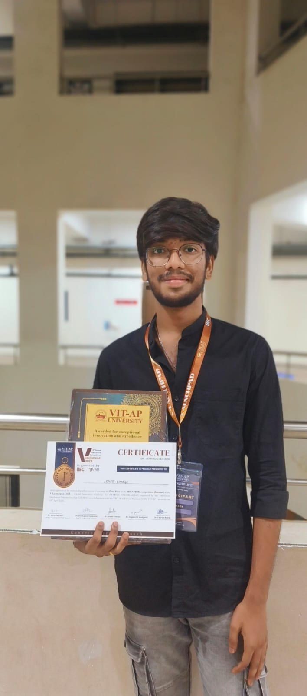
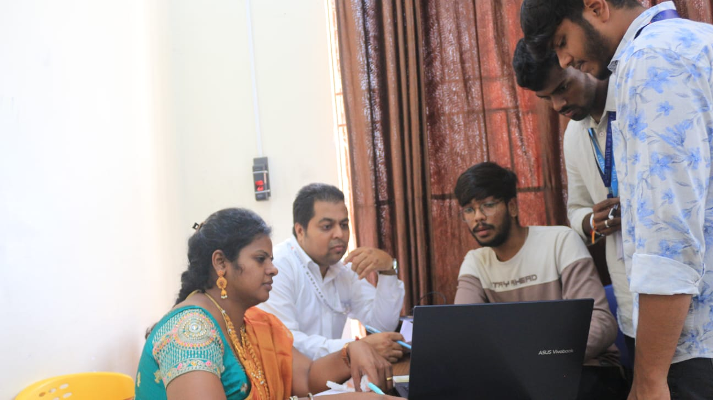

<div align="center">

  <a href="https://github.com/DHANUSH-BHEEMSETTY">
    
  </a>

  <br><br>

  # Dhanush Bheemisetty
  
  ### 🚀 **AI Engineer • Venture Builder • High-Velocity Vibe Coder**
  *VIT-AP University • B.Tech Computer Science (AI & ML) • CGPA: 8.84*

  <br>

  [](mailto:dhanushbheemisetty0@gmail.com)
  [](https://drive.google.com/file/d/1wEuhZrC7hCYjdq86LnA1EEZkBDLjqNnJ/view)

  <br>

  <a href="https://git.io/typing-svg">
    
  </a>

  <br><br>

  [](https://www.linkedin.com/in/dhanush-bheemisetty/)
  [](https://github.com/DHANUSH-BHEEMSETTY)
  [](mailto:dhanushbheemisetty0@gmail.com)
  [](tel:+917989107910)
  [](./Dhanush_Bheemisetty_Resume.pdf)
  [](./PORTFOLIO_INFO.md)

</div>

---

## ⚡ Opportunity Seeker Snapshot (Why Hire Dhanush?)

I am a hungry, high-velocity software engineer combining **enterprise-grade discipline** with a **scrappy 0-to-1 startup builder mindset**. I leverage modern AI tooling (Claude Code, agentic workflows, Cursor) to ship robust production software 5x–10x faster.

| Attribute | Summary for Recruiters & Founders |
| :--- | :--- |
| 🎯 **Target Roles** | **Software Development Engineer (SDE), AI/ML Engineer, Full-Stack Developer, Founding Engineer** |
| 🟢 **Availability** | **Immediate / Summer / 6-Month Co-ops & New Grad Roles** (Open to Remote, Hybrid, or Relocation) |
| 🏆 **Top Achievement** | **1st Place Winner – VLaunch Pad 2025** (Recognized by Central Minister **Dr. Pemmasani Chandra Shekhar**) |
| 💼 **Enterprise Experience** | **Java Developer Intern** at *SysIntelli Software* (Enterprise OOP backends, performance tuning, and defect reduction) |
| 🎓 **Academic Rigor** | **8.84 CGPA** at VIT-AP • **96.9%** in Intermediate (MPC) • **97.8%** in 10th Board (Top 1–2% statewide) |
| ⚡ **Superpower** | **"Vibe Coder" & Rapid Prototyper:** Taking fuzzy concepts to fully functional, deployed cloud/AI systems in days. |

---

## 🚀 The 0-to-1 Entrepreneurial Mindset

I don't just write algorithms; I solve real customer pain points and build viable products:

* **Startup Ideation & Validation (HoverCharge):** Conceived and architected an on-demand mobile EV wireless charging network. Researched market infrastructure deficits, modeled fleet unit economics, and built a live interactive React prototype.
* **Executive Pitching & Stakeholder Defense:** Pitched before a distinguished jury of investors, venture leaders, and Union Minister Dr. Pemmasani Chandra Shekhar, winning **#1 First Prize out of university teams**.
* **Product-First Engineering:** Whether architecting zero-trust Postgres Row-Level Security in **Legacy Wallet** or eliminating LLM hallucination in **Smart Resume Screener**, I design systems with high user trust, compliance, and product ROI in mind.

---

## 🔭 The AI Radar & Passions (Always Staying Ahead)

> *"My hobby isn't just coding—it's staying constantly connected to the bleeding edge of artificial intelligence."*

* ⚡ **Daily Frontier Model Tracking:** Every week, I experiment with newly released models and benchmarks (Claude 3.7 Sonnet / Reasoning, Gemini 2.0, DeepSeek R1 / V3, OpenAI o-series) to evaluate latency, tool-calling precision, and practical cost-to-performance tradeoffs.
* 🤖 **Claude Code & Agentic Dev Workflows:** Enthusiastic early adopter and power user of Anthropic's **Claude Code** and multi-agent systems, integrating terminal subagents and agentic refactoring into my daily shipping loops.
* 📄 **ArXiv & Open Source Drops:** Regularly following papers on multimodal architectures, Model Context Protocol (MCP), dynamic graph pathfinding, and vision-language reasoning.

---

## 🛠️ Skills & Technical Stack

<div align="center">

### 🤖 Modern AI, "Vibe Coding" & Agentic Engineering


<br>

### 💻 Core Programming Languages


<br>

### 🌐 Frontend & User Experience


<br>

### ⚙️ Backend, Cloud & Security


</div>

---

## 🏆 Featured Honors & In-Action Gallery

### 🥇 1st Place Winner — VLaunch Pad 2025 (IIEC-VIT-AP)
* **Concept:** **HoverCharge** — Next-Gen AI-Driven Mobile EV Wireless Charging Network.
* **Recognition:** Awarded and felicitated by **Central Minister Dr. Pemmasani Chandra Shekhar** (Minister of State for Rural Development and Communications, Government of India).
* **Credential:** [📜 Official Appreciation Letter & Certificate (Google Drive)](https://drive.google.com/file/d/1wEuhZrC7hCYjdq86LnA1EEZkBDLjqNnJ/view)

<br>

<div align="center">
  <table>
    <tr>
      <td align="center" width="42%">
        
        <br><br>
        <sub><b>🥇 1st Place Winner — VLaunch Pad 2025</b><br>Holding Certificate & Award Plaque at VIT-AP</sub>
      </td>
      <td align="center" width="58%">
        
        <br><br>
        <sub><b>⚡ Live Pitch & System Demonstration</b><br>Presenting HoverCharge architecture & AI features to evaluators</sub>
      </td>
    </tr>
  </table>
</div>

---

## 💼 Enterprise Work Experience

### **SysIntelli Software and Services Pvt Ltd**
**Student Intern – Java Developer** | *Remote*  
`May 2025 – August 2025`

* **Enterprise Backend Engineering:** Developed and maintained modular Java backend micro-modules adhering to strict OOP principles and design patterns.
* **Performance Profiling & Bottleneck Optimization:** Investigated runtime database query latency, refactored data structures, and eliminated high-priority edge-case bugs.
* **Production Standards & Agile Collaboration:** Participated in daily standups, code reviews, and enterprise Git workflows alongside senior developers.
* **Quality Verification:** Authored unit tests and verified API contracts across the full SDLC.

---

## 🚀 Featured Production Projects

### 1. [HoverCharge — AI-Driven EV Charging Startup Platform](https://hovercharge-react.onrender.com/)
> **Awarded 1st Place at VLaunch Pad 2025** | High-velocity AI & React startup MVP  
> **[🌐 Live Demo](https://hovercharge-react.onrender.com/)**  •  **[📜 View Award Letter](https://drive.google.com/file/d/1wEuhZrC7hCYjdq86LnA1EEZkBDLjqNnJ/view)**

* **Challenge:** EV drivers suffer from route disruption and lengthy charging station queues.
* **Solution:** High-performance web platform featuring a brutalist, responsive UI, interactive Gemini AI conversational assistant for live driver dispatch questions, and Chart.js energy savings visualizers.
* **Stack:** `React 19` • `Vite` • `Google Gemini API` • `Chart.js` • `CSS3 Animations`
* **Venture Impact:** Proved technical scalability and commercial fleet unit economics before venture judges to secure the #1 win.

---

### 2. [Smart Resume Screener](https://github.com/DHANUSH-BHEEMSETTY/RESUME_SCREENER)
> Automated, explainable candidate ranking using structured LLM outputs and deterministic scoring.  
> **[📂 Source Code](https://github.com/DHANUSH-BHEEMSETTY/RESUME_SCREENER)**

* **Challenge:** Traditional ATS tools miss strong talent with brittle keyword matches, while standard LLMs hallucinate qualifications without auditability.
* **Solution:** Multi-stage resume ingestion pipeline extracting structured candidate attributes with Gemini 1.5 Flash and Zod schemas, coupled to a deterministic mathematical scoring engine with transparent Explainable AI (XAI) badges.
* **Stack:** `React` • `Node.js` • `TypeScript` • `Google Gemini 1.5 Flash` • `Zod` • `Tailwind CSS`

---

### 3. [Real-Time Restricted Area Monitoring System](https://github.com/DHANUSH-BHEEMSETTY/Real_Time_Restricted_Area_Monitoring_System)
> Ultra-low latency edge AI surveillance pipeline with cloud alert distribution.  
> **[📂 Source Code](https://github.com/DHANUSH-BHEEMSETTY/Real_Time_Restricted_Area_Monitoring_System)**

* **Challenge:** Industrial security requires instant intrusion alerts without overburdening cloud servers with raw video streams.
* **Solution:** Decoupled edge clients running YOLOv8 object detection on camera feeds, streaming lightweight violation payloads to a FastAPI backend, logging to Supabase, and broadcasting sub-100ms alerts over WebSockets to a Streamlit control center.
* **Stack:** `Python` • `YOLOv8` • `OpenCV` • `FastAPI` • `Streamlit` • `Supabase (PostgreSQL)` • `WebSockets`

---

### 4. [Legacy Wallet — Secure Cloud-Native Digital Inheritance](https://legacy-wallet-yjyw.onrender.com/)
> Zero-trust digital vault for inheritance asset allocation with fine-grained Row-Level Security.  
> **[🌐 Live Demo](https://legacy-wallet-yjyw.onrender.com/)**

* **Challenge:** Transferring confidential assets and wills to beneficiaries post-mortem without compromising user privacy.
* **Solution:** Multi-tenant encrypted asset vault with AI-assisted legal phrasing, multi-modal file uploads, and PostgreSQL Row-Level Security (RLS) policies guaranteeing cryptographic isolation across tenants.
* **Stack:** `React` • `TypeScript` • `Supabase` • `PostgreSQL` • `Tailwind CSS`

---

### 5. Smart Building Safety Monitoring *(Active R&D)*
> Real-time computer vision hazard detection + dynamic graph-based evacuation pathfinding.
* Ingests CCTV video with YOLOv8 for fire/smoke detection, updating a floor-plan graph to calculate safe, hazard-free egress paths using **A* and Dijkstra algorithms** via NetworkX.
* **Stack:** `Python` • `FastAPI` • `Streamlit` • `YOLOv8` • `OpenCV` • `NetworkX`

---

## 🎓 Education & Academic Record

```
VIT-AP University                                                    09/2023 – Present
Bachelor of Technology (B.Tech) in Computer Science (AI & ML)             CGPA: 8.84 / 10.0
• Coursework: Data Structures, Algorithms, OOP (Java), DBMS, OS, Computer Networks, AI & ML

Sri Chaitanya Junior College                                         09/2021 – 03/2023
Board of Intermediate Education, Andhra Pradesh (MPC)                    Score: 96.9%

Andhra Pradesh Residential School                                    06/2020 – 04/2021
Board of Secondary Education, Andhra Pradesh (SSC)                       Score: 97.8%
```

---

## 📊 GitHub Analytics

<div align="center">

  
  

  <br>

  

</div>

---

## 📬 Let's Connect — Ready to Build & Ship!

I am actively interviewing and exploring **SDE, Full-Stack, AI Engineer, and Founding Engineer roles** for the current hiring season. If you are building high-growth systems or have an open engineering role, let's talk!

* 📧 **Email:** [dhanushbheemisetty0@gmail.com](mailto:dhanushbheemisetty0@gmail.com)
* 💼 **LinkedIn:** [linkedin.com/in/dhanush-bheemisetty](https://www.linkedin.com/in/dhanush-bheemisetty/)
* 💻 **GitHub:** [@DHANUSH-BHEEMSETTY](https://github.com/DHANUSH-BHEEMSETTY)
* 📱 **Phone / WhatsApp:** [+91 7989107910](tel:+917989107910)
* 📄 **Read the Comprehensive Portfolio Dossier:** [PORTFOLIO_INFO.md](./PORTFOLIO_INFO.md)

<br>

<div align="center">
  <sub>Designed & engineered with precision by Dhanush Bheemisetty • 2025–2026 Hiring Season</sub>
</div>
